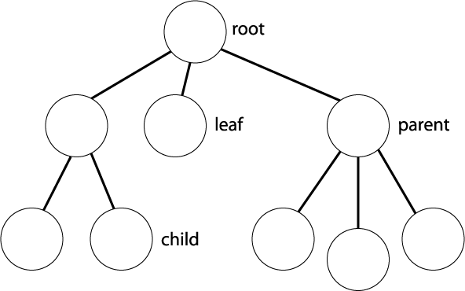

##Árvores

> Árvores - Estrutura de dados

Uma Árvore, no contexto da computação, é uma estrutura de dados na qual os dados estão dispostos de forma hierárquica, herdando as 
características da topologia de uma árvore.

Temos de enxergá-la de cima para baixo, pois que a raiz da árvore fica no topo.

###Elementos e suas nomenclaturas

####Nó

Um elemento qualquer na **Árvore**.

####Raiz

A **Raiz** da nossa estrutura é o topo da hierarquia, pois tudo dela deriva. Não tem pai, porém tem filhos.

####Filho

**Filho** se refere a um elementa que deriva de um elemento acima de si na cadeia, chamado elemento **Pai**.

####Pai

Se refere a um elemento que está acima de algum elemento na cadeia, seus elementos **Filhos**.

####Irmão(Simbling)

Descendente de um mesmo pai.

####Folha

Um elemento na ponta de um ramo é chamado de **Folha**.
###Hierarquia

Dizemos que todo elemento que venha acima de tal elemento na cadeia é seu **Ancestral** (desde que estejam ligados, claro), assim como todo elemento abaixo de tal elemento (ligados) é seu **Descendente**.

###Propriedades

####Estrutura de dados recursiva

Podemos tratar uma **Árvore** de maneira recursiva de um diferente ponto de vista, pois que a **Raiz** é ligada à **Raiz** de uma
sub-árvore.

####Nós

Para cada **Árvore**, um número N de nós resulta em um número N - 1 de Ligações.

####Profundidade

A **Profundidade** de um elemento `x` pode ser definida como a distância entre a **Raiz** até o elemento `x`, ou melhor dizendo, número de ligações no caminho da **Raiz** até o elemento `x`.

####Altura

A **Altura** de um elemento `x` pode ser definida como o maior caminho entre o elemento `x` e uma folha, ou melhor dizendo, número de ligações no maior caminho entre o elemento `x` e uma folha.

#####Altura da **Árvore**

A **Altura da Árvore** pode ser definida como a altura do nó **Raiz**.

###Ordem

####Árvore Binária

Uma **Árvore** na qual cada **Nó** pode ter no máximo 2 **Filhos** 

