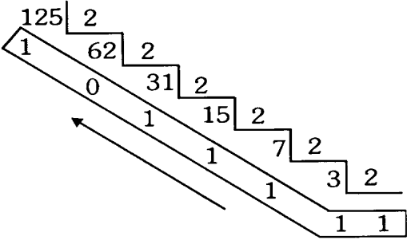

# Sistema de Numeração

> Um sistema de numeração é um sistema que representa números de uma forma consistente. A operação básica de um sistema de numeração é a contagem. Ao se contar o número de objetos de uma coleção, divide-se o conjunto em grupos com um determinado número de objetos,  denominado base ou raiz do sistema de numeração.

Em geral, temos que:

- O número de dígitos usado no sistema é igual à sua base.
- O maior dígito é sempre menor que a base (`n = b-1`).
- O algarismo mais significativo está à esquerda, e o menos significativo à direita.
- Em geral se toma a [base decimal](#sistema-decimal) como referência.

## Sistema Binário *(Base 2)*

> O sistema binário utiliza dois símbolos (algarismos) para representar qualquer quantidade: `0` e `1`.

Este segue as mesmas regras do sistema decimal e utiliza os conceitos de peso e posição dos algarismos. Os termos unidades, dezenas, centenas, etc, são exclusivos do sistema decimal e não há não há semelhantes no sistema binário. Cada algarismo ou dígito de um número binário é chamado de bit, ou a abreviação de binary digit (dígito binário) - como se pode ver [nesta seção](material/bits-bytes).

## Sistema Octal (Base 8)

O sistema octal apresenta apenas 8 símbolos: *0, 1, 2, 3, 4, 5, 6, 7*.

## Sistema Decimal (Base 10)

> O sistema decimal, então, utiliza 10 símbolos (algarismos) para representar qualquer quantidade: *0, 1, 2, 3, 4, 5, 6, 7, 8, 9*.

Para representar quantidades maiores que a base são utilizados pesos para algarismos associadas à suas posições ou casas decimais. Quanto mais à esquerda for a posição do algarismo, maior seu peso, o qual é 10 vezes maior que a posição anterior, uma vez que a base é 10.

## Sistema Hexadecimal *(Base 16)*

O sistema hexadecimal possui 16 símbolos, dos quais os dez primeiros são os mesmo do sistema decimal (*0, 1, 2, 3, 4, 5, 6, 7, 8, 9*), e os demais são adotados as letras *A, B, C, D, E e F*.

## Conversão

### Divisão

> `Decimal` -> `Outros`

Consiste em fazer sucessivas divisões pelo número número da base a qual se almeja chegar. Ex.:

- Converter 125, na base 10, para a base 2.

  

  Assim, 125(10) = 1111101(2)

- Converter 538, na base 10, para a base 16.

  

  Assim, 538(10) = 21A(2)

### Lei de Formação

> `Outros` -> `Decimal`

Consiste em decompor um número da seguinte forma:

onde:

`an` = algarismo

`b`  = base do número

`n`  = qtd. de algarismo - 1

Ex.:

- Converter 1101, da base 2, para a base 10.

  

- Converter 3AF7, da base 16, para a base 10.

  

